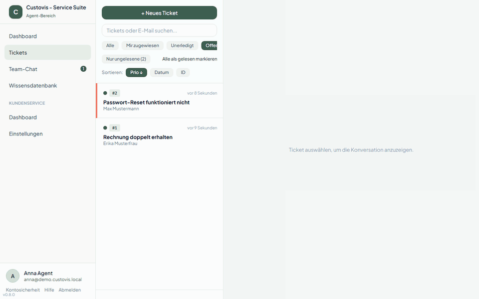
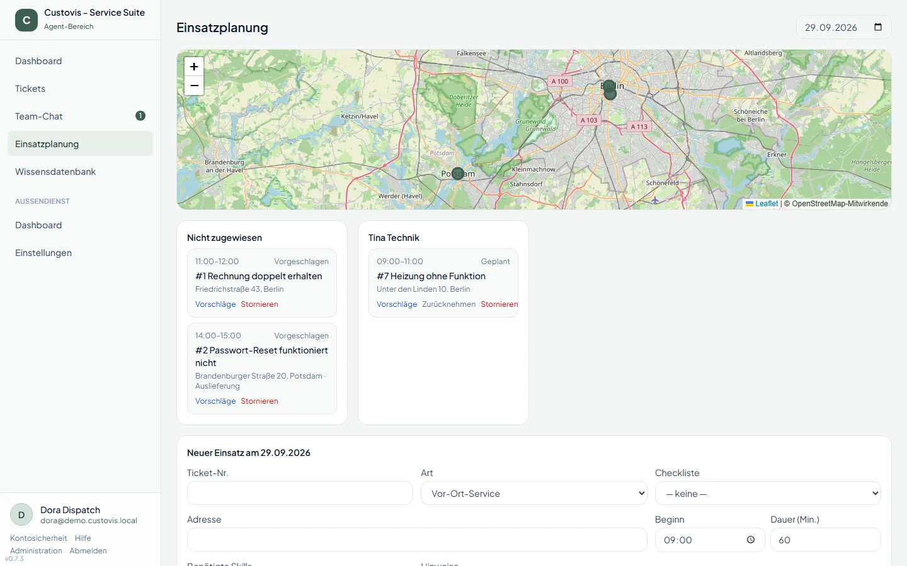
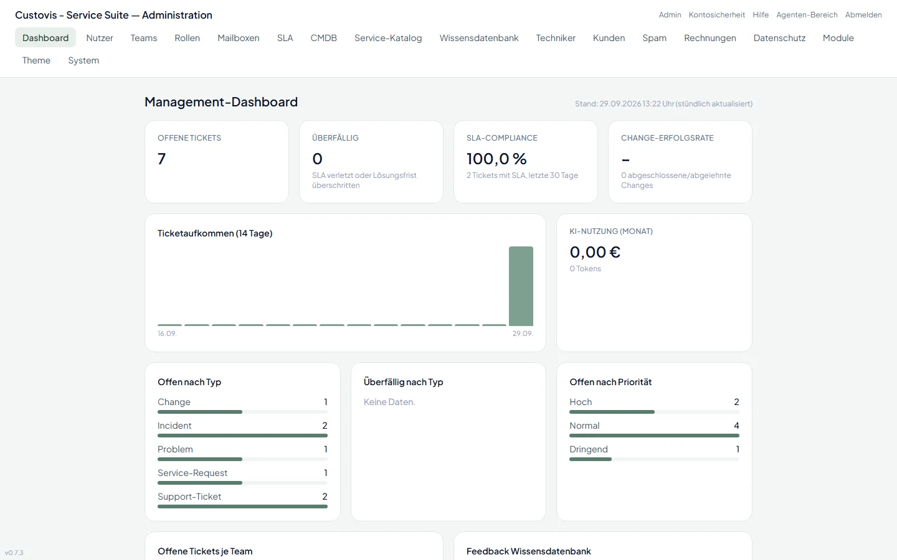
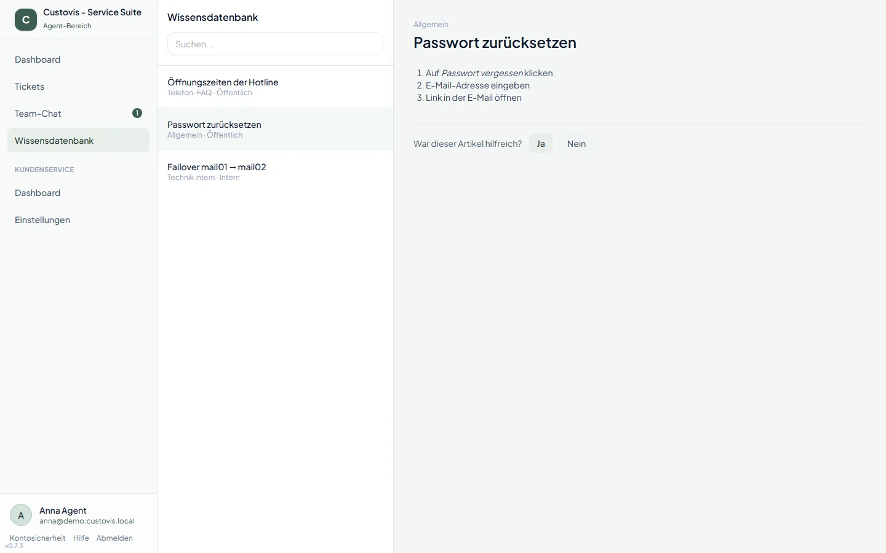
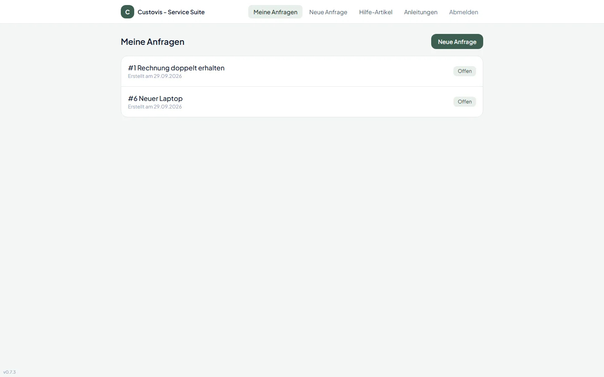

# Custovis – Open-Source-Service-Suite für Helpdesk, ITSM und Außendienst

[](https://github.com/coprea71/custovis/actions/workflows/ci.yml)
[](https://github.com/coprea71/custovis/releases)
[](LICENSE)

[English](README.en.md) | **Deutsch**

**Custovis ist eine quelloffene ITSM- und Kundenservice-Suite (AGPLv3) auf Basis von
Laravel 12.** Sie vereint Shared-Mailbox-Ticketing (wie FreeScout), Self-Service und
KI-Funktionen (wie Zammad) sowie Incident-, Problem-, Change- und Request-Management
mit CMDB (wie iTop/GLPI) und eine Techniker-Einsatzplanung in einer Anwendung. Alle
Funktionen sind kostenlos, es gibt keine Paywall und keine Editionen. Custovis läuft
auch auf einfachem Webhosting ohne SSH-Zugang: Installation und Updates erfolgen per
FTP/SFTP und Web-Installer.



## Für wen ist Custovis?

- **Kundenservice-Teams**, die E-Mails, WhatsApp-Nachrichten und Anrufe als Tickets
  in gemeinsamen Postfächern bearbeiten.
- **IT-Abteilungen und Dienstleister**, die nach ITIL mit Incidents, Problems,
  Changes, Service Requests, SLAs und einer CMDB arbeiten.
- **Service-Unternehmen mit Außendienst**, die Techniker-Einsätze planen und vor Ort
  offline dokumentieren.
- **Unternehmen mit Datenschutz-Anforderungen**, die eine selbst gehostete Lösung mit
  2FA, Audit-Log und DSGVO-Werkzeugen brauchen.

## 100 % Open Source, keine Paywall

Die meisten vergleichbaren Tools verkaufen Kanäle, KI, Kundenportal oder
Außendienst als Zusatzmodule. Custovis enthält all das von Anfang an:

- unbegrenzt viele Agenten, Tickets und Mailboxen
- KI-Funktionen über selbst konfigurierte API-Keys, ohne Nachkauf-Kosten beim Hersteller
- Kundenportal, WhatsApp-Anbindung, externe Ticket-API, GitHub-/GitLab-Issue-Import
- Techniker-Einsatzplanung mit Offline-App und MCP-Schnittstelle für KI-Telefonassistenten

## Funktionen im Überblick

| Bereich | Funktionen |
|---|---|
| **Ticket-Kern** | IMAP-Import je Mailbox, Antworten per SMTP über die Mailbox des Teams, E-Mail-Layout und Signatur je Team, interne Notizen, Textbausteine, Tags, Spamfilter je Team, Collision Detection in Echtzeit |
| **Kanäle** | E-Mail, WhatsApp Business (Meta Cloud API), REST-API mit teamverwalteten API-Keys, GitHub-/GitLab-Issues, Telefon über MCP |
| **ITIL** | Incident, Problem, Change mit CAB-Freigabe, Service Requests aus dem Service-Katalog, SLA-Engine mit Geschäftszeiten und Kunden-SLAs, CMDB |
| **KI-Layer** | Austauschbare Provider (OpenAI, Anthropic, Ollama, eigener Endpunkt), Zusammenfassung, Antwortvorschlag, Triage, ähnliche Tickets, Budgets je Team, optionale PII-Schwärzung |
| **Dashboards** | Management-Dashboard über alle Teams, Team-Dashboards mit Auslastung und SLA-Verletzungen, stündliche Snapshots |
| **Wissensdatenbank** | Kategorien-Baum, versionierte Markdown-Artikel mit Diff und Rollback, Volltextsuche, Feedback, Verknüpfung mit Tickets |
| **Team-Chat** | Team-, Firmen- und Ticket-Kanäle, Direktnachrichten, Ungelesen-Zähler, Echtzeit über Laravel Reverb |
| **Kundenportal** | Eigene Tickets mit Status-Timeline, Anfragen aus dem Service-Katalog, öffentliche Hilfe-Artikel, Passwort-Reset |
| **Außendienst** | Technikerverwaltung (Skills, Schichten, Abwesenheiten), Dispatcher-Board mit Drag & Drop und Zuweisungsvorschlag, Routing über selbst gehostetes OSRM/Nominatim, Offline-PWA mit Checklisten, Unterschrift und Lieferschein-PDF |
| **ERP-Anbindung** | Kundendaten aus Odoo oder Shopware 6 live in der Ticket-Sidebar, ohne Datenimport |
| **Zeiterfassung & Rechnungen** | Zeit am Ticket buchen (Timer), Einzel- und Sammelrechnungen, E-Rechnung als ZUGFeRD-PDF und XRechnung-XML, GoBD-konforme Nummern und Storno |
| **Administration** | Nutzer, Teams, Rollen und Berechtigungen, Kundenverwaltung, Modulverwaltung je Rolle/Nutzer, Themes, Schema-Updates ohne Shell |
| **Compliance** | 2FA-Pflicht, Passkeys, Audit-Log, verschlüsselte Zugangsdaten, DSGVO-Auskunft und -Anonymisierung, Aufbewahrungsfristen |

## Screenshots

<table>
  <tr>
    <td width="50%"><br><sub>Einsatzplanung mit Karte und Drag & Drop</sub></td>
    <td width="50%"><br><sub>Management-Dashboard über alle Teams</sub></td>
  </tr>
  <tr>
    <td width="50%"><br><sub>Wissensdatenbank</sub></td>
    <td width="50%"><br><sub>Kundenportal</sub></td>
  </tr>
  <tr>
    <td colspan="2" align="center"><br><sub>Offlinefähige Techniker-App</sub></td>
  </tr>
</table>

## Funktionsbeschreibung

### Ticketsystem und Agenten-Arbeitsplatz

Custovis ruft beliebig viele Postfächer per IMAP ab und macht aus jeder neuen
E-Mail ein Ticket. Antworten werden per SMTP über die Mailbox des Tickets verschickt
und landen im selben Verlauf. Der Arbeitsplatz unter `/agent` zeigt Ticketliste und Ticket
nebeneinander:

- öffentliche Antwort oder interne Notiz, Textbausteine je Team, Tags
- E-Mail-Layout je Team: Team-Admins legen Farbe, Schrift, Logo, Signatur mit
  Platzhaltern und Fußzeile fest, mit Live-Vorschau; Versand mit Nur-Text-Fassung
- Kontaktdaten und interne Notizen des Kunden per Info-Knopf in der Seitenleiste;
  fehlende Angaben lassen sich dort direkt hinterlegen
- Tickets derselben E-Mail-Adresse landen automatisch beim selben Kunden – über alle
  Kanäle, unabhängig von Groß-/Kleinschreibung, auch rückwirkend beim Anlegen des Kunden
  oder Ändern seiner Adresse
- Status, Priorität, Team und Bearbeiter direkt in der Seitenleiste ändern
- optional je Team (vom Team-Admin eingeschaltet): unzugewiesene Tickets gehen beim
  Öffnen automatisch an das Teammitglied, das sie ansieht
- als wichtig oder dringend markierte E-Mails (X-Priority, Importance) setzen die
  Ticket-Priorität automatisch; ein Farbstreifen zeigt sie in der Liste, Notfälle sind
  rot umrahmt und mit Warnsymbol markiert
- Tickets für telefonische oder persönliche Anfragen manuell anlegen
- Spamfilter: Mail-Tickets per Klick als Spam markieren und dabei die Absenderadresse
  oder die ganze Domain für das Team sperren; künftige Mails landen im Spam-Ordner der
  Administration, lassen sich dort freigeben und werden nach 30 Tagen gelöscht
- Filter wie „Mir zugewiesen“, die Einstellungen von Filter und Sortierung bleiben je
  Nutzer gespeichert; Agenten sehen nur Tickets ihrer Teams
- Collision Detection: In Echtzeit ist sichtbar, wer ein Ticket gerade bearbeitet

### Kanäle und Schnittstellen

- **WhatsApp Business** über die Meta Cloud API: Ein Chat entspricht einem Ticket,
  inklusive 24-Stunden-Regel und genehmigter Vorlagen.
- **REST-API** (`POST /api/v1/tickets`) mit API-Keys, die jedes Team selbst verwaltet.
- **GitHub-/GitLab-Issues** werden per Webhook oder regelmäßiger Abfrage als Tickets
  importiert, auch aus selbst betriebenen GitLab-Instanzen.
- **MCP-Schnittstelle** (`POST /mcp`) für KI-Telefonassistenten: Tickets anlegen und
  suchen, Status abfragen, Gesprächsnotizen ergänzen, freigegebene Hilfe-Artikel
  durchsuchen.

### ITIL-Prozesse

Neben einfachen Tickets kennt Custovis die ITIL-Typen Incident (Auswirkung und
Dringlichkeit), Problem (Ursache), Change (Typ, Risiko, Zeitfenster) und Service
Request. Jeder Typ hat einen festen Lebenszyklus. Changes durchlaufen eine
CAB-Freigabe mit eigenem Freigabe-Eingang. Die SLA-Engine berechnet Fristen in den
Geschäftszeiten des Teams und meldet Verletzungen; vertragliche SLAs einzelner Kunden
haben Vorrang vor der Team-SLA. Service Requests entstehen aus
einem Service-Katalog, Configuration Items aus der CMDB lassen sich Tickets zuordnen.

### KI-Assistenz

KI-Funktionen laufen mit eigenen API-Keys bei OpenAI, Anthropic, einer lokalen
Ollama-Instanz oder einem eigenen Endpunkt. Custovis fasst Tickets zusammen,
schlägt Antworten vor, ordnet neue Tickets automatisch zu und findet ähnliche
Tickets. Pro Team lassen sich Provider und Budget festlegen, personenbezogene Daten
können vor dem Versand geschwärzt werden.

### Wissensdatenbank und Kundenportal

Hilfe-Artikel werden in Markdown geschrieben, versioniert (mit Diff und Rollback)
und als intern oder öffentlich markiert. Agenten fügen Artikel direkt in Antworten
ein. Kunden melden sich im Portal unter `/portal` an, sehen nur ihre eigenen Tickets
mit Status-Verlauf, stellen neue Anfragen aus dem Service-Katalog und durchsuchen die
öffentlichen Hilfe-Artikel.

### Zeiterfassung und Rechnungen

Agenten buchen ihren Aufwand direkt im Ticket, manuell oder per Start/Stopp-Timer, und
markieren ihn als abrechenbar oder intern. Team-Admins rechnen die offenen Zeiten ab:
als Einzelrechnung je Kunde oder als Sammelrechnung für einen Zeitraum, mit einer Position
je Ticket. Jede Rechnung ist eine E-Rechnung nach EN 16931 und geht per E-Mail als
ZUGFeRD-PDF (PDF/A-3, Profil EN 16931) und als XRechnung-3.0-XML an den Kunden.

- fortlaufende Rechnungsnummern je Jahr, ausgestellte Rechnungen sind unveränderbar,
  Korrekturen laufen über eine Stornorechnung (GoBD)
- Kleinunternehmerregelung (§ 19 UStG), Leitweg-ID für öffentliche Auftraggeber
- offene Posten, Zahlungseingang und überfällige Rechnungen im Blick

### Team-Chat und Dashboards

Der interne Chat bietet Team-, Firmen- und Ticket-Kanäle sowie Direktnachrichten in
Echtzeit. Das Management-Dashboard zeigt Kennzahlen über alle Teams, die
Team-Dashboards Auslastung, offene Tickets und SLA-Verletzungen des eigenen Teams.

### Außendienst und Einsatzplanung

Disponenten planen Einsätze auf einem Board mit Karte per Drag & Drop. Eine
Zuweisungs-Engine schlägt passende Techniker nach Skill, Team, Entfernung und
Verfügbarkeit vor. Techniker arbeiten mit der offlinefähigen Web-App unter `/field`:
Checklisten abhaken, Material und Warenauslieferungen erfassen, die Unterschrift des
Kunden einholen und einen Lieferschein als PDF am Ticket ablegen. Sobald wieder Netz
da ist, wird automatisch synchronisiert.

### Administration und Betrieb

- Nutzer, Teams und Rollen mit fein steuerbaren Berechtigungen; neue Nutzer setzen
  ihr Passwort selbst über einen Einladungslink.
- Kundenverwaltung mit Telefon, Mobil, Adresse, internen Notizen, Portal-Zugang und
  Einladungslink.
- Modulverwaltung: Funktionsbereiche global abschalten oder nur für bestimmte Rollen
  oder Nutzer freigeben.
- Wählbare und erweiterbare Farb-Themes.
- Eine Installation kann unter mehreren Domains laufen (`APP_HOSTS`).
- Datenbank-Updates per Klick unter **Administration → System**, ohne Shell-Zugriff.
- Eingebaute Hilfe unter `/agent/help` mit Schritt-für-Schritt-Anleitungen zu allen
  Funktionen, gefiltert nach Rechten und freigeschalteten Modulen; Kunden finden eine
  eigene Hilfe unter `/portal/help`.

### Sicherheit und Datenschutz

Zwei-Faktor-Authentifizierung ist für Agenten und Admins Pflicht, Passkeys werden
unterstützt. Sicherheitsrelevante Änderungen landen im Audit-Log, Zugangsdaten
externer Systeme werden verschlüsselt gespeichert. Server-URLs externer Systeme
dürfen nicht auf interne Adressen zeigen (SSRF-Schutz). Für die DSGVO gibt es Auskunft und
Anonymisierung je Kunde sowie konfigurierbare Aufbewahrungsfristen.

## Tech-Stack

- Laravel 12, PHP 8.2+, MySQL/MariaDB
- Auth: Laravel Fortify und Sanctum mit getrennten Guards (`web`, `customer`, `sanctum`), TOTP-2FA
- Rechte: `spatie/laravel-permission` und ein eigenes Team-Modell
- Frontend: Livewire, Blade und Alpine.js, Tailwind über Vite (kein CDN, kein Filament)
- Echtzeit: Laravel Reverb, optional – ohne Reverb-Server (z. B. Webhosting ohne Shell)
  aktualisieren sich Team-Chat und Kollisionserkennung per Polling; Queues: Datenbank-Treiber (cron-tauglich), Redis optional
- MCP: offizielles `laravel/mcp` (Streamable HTTP)
- E-Rechnung: `horstoeko/zugferd` (XRechnung/ZUGFeRD), PDF über `barryvdh/laravel-dompdf`

## Installation

Auf den Zielservern besteht in der Regel kein SSH-Zugriff. Deshalb gibt es zwei Wege:

### 1. Web-Installer (FTP/SFTP)

1. Das Release-Archiv `custovis-vX.Y.Z.zip` von der
   [Releases-Seite](https://github.com/coprea71/custovis/releases) laden. Es enthält `vendor/` und die gebauten
   Frontend-Assets.
2. Das Archiv per FTP/SFTP hochladen und den Webserver auf das Verzeichnis `public/`
   zeigen lassen. Lässt der Hoster das nicht zu, darf die Domain auch auf den
   Projektordner zeigen – die `.htaccess` im Projektordner leitet dann alles nach
   `public/` weiter.
3. `https://ihre-domain/install` aufrufen, Datenbank-Zugang und ersten Administrator
   eintragen, optional Demo-Daten anlegen.
4. Danach ist der Installer dauerhaft gesperrt (`storage/installed.lock`). Er öffnet
   sich auch nie auf einem System, das bereits Benutzer hat.
5. Soll dieselbe Installation unter weiteren Domains erreichbar sein, diese in der
   `.env` als `APP_HOSTS=support.example.org,support.example.net` eintragen (`APP_URL`
   bleibt die Hauptdomain für Canonical-Links, E-Mails und Konsole). Andere Hosts
   werden abgewiesen. Passkeys gelten technisch nur für die Domain, auf der sie
   angelegt wurden.

### 2. Kommandozeile

```bash
composer install --no-dev --optimize-autoloader
npm ci && npm run build
cp .env.example .env        # Datenbank-Zugang eintragen
php artisan key:generate
php artisan custovis:install  # optional: --demo
```

### Nach der Installation

- **Cronjob:** einmal pro Minute `php artisan schedule:run` (Mailabruf, SLA-Prüfung,
  Dashboards, Aufbewahrungsfristen).
- **Queue-Worker:** `php artisan queue:work --queue=default,mail-fetch,mail-send,git-sync,ai-processing,whatsapp,notifications,field-sync`.
  Ohne dauerhaften Prozess geht auch ein Cronjob mit `queue:work --stop-when-empty`.
- **Nur Web-Cron möglich (kein Shell-Cronjob):** Unter **Administration → System → Web-Cron**
  eine geheime URL erzeugen und minütlich aufrufen lassen. Sie ersetzt Cronjob und Queue-Worker.
- **Zeitzone:** `APP_TIMEZONE` in der `.env` (Standard `Europe/Berlin`). Geschäftszeiten,
  SLA-Fristen und Einsatztermine gelten in dieser Zeitzone.
- **Zwei-Faktor-Authentifizierung** ist für Agenten und Admins in Produktion Pflicht.
  Sie wird beim ersten Login eingerichtet.
- **Updates:** neue Version per FTP hochladen, dann unter **Administration → System**
  die ausstehenden Migrationen ausführen.

### Lokale Entwicklung

```bash
composer install && npm install && npm run build
cp .env.example .env && php artisan key:generate
php artisan migrate --seed
php artisan db:seed --class=DemoSeeder   # Demo-Konten, Passwort: demo-passwort
php artisan test
```

## Weitere Dokumentation

- [Änderungsprotokoll](CHANGELOG.md)

## Lizenz

Copyright (C) 2026 Dirk Eichner

Custovis steht unter der [GNU Affero General Public License v3.0](LICENSE)
(`AGPL-3.0-only`). Die AGPLv3 schließt die SaaS-Lücke und schützt den
Open-Source-Charakter dauerhaft:

- Sie dürfen Custovis kostenlos nutzen, verändern und weitergeben – auch kommerziell.
- Wer eine veränderte Version weitergibt **oder Nutzern über ein Netzwerk
  bereitstellt** (z. B. als gehosteten Dienst), muss deren vollständigen Quellcode
  ebenfalls unter der AGPLv3 zugänglich machen.
- Die Software wird ohne jegliche Gewährleistung bereitgestellt.

Maßgeblich ist allein der Lizenztext in der Datei [LICENSE](LICENSE).

## Kontakt

- Fehler und Wünsche: [GitHub-Issues](https://github.com/coprea71/custovis/issues)
- Sonstige Anfragen: [support@fahrklar.net](mailto:support@fahrklar.net)

## Sicherheit

Siehe [SECURITY.md](SECURITY.md).

## Contributing

Siehe [CONTRIBUTING.md](CONTRIBUTING.md).
